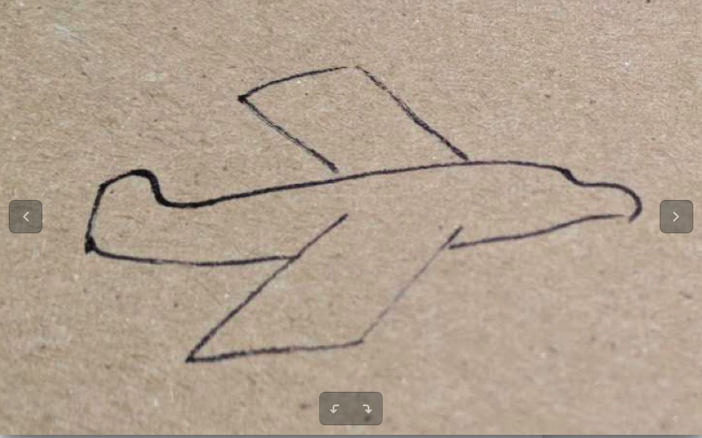
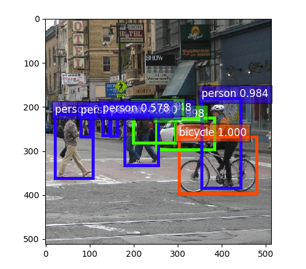
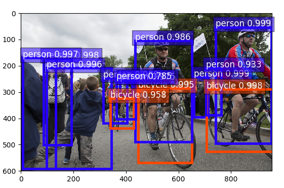
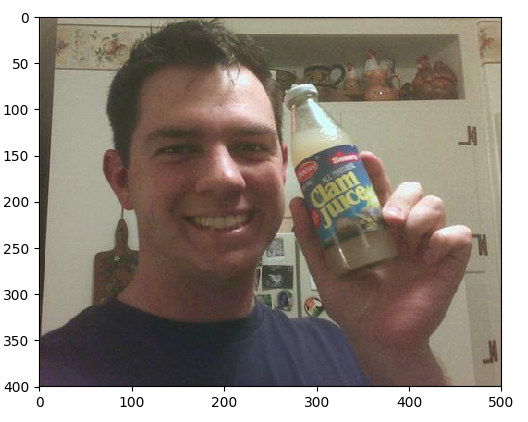
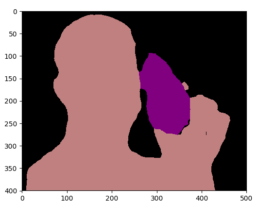
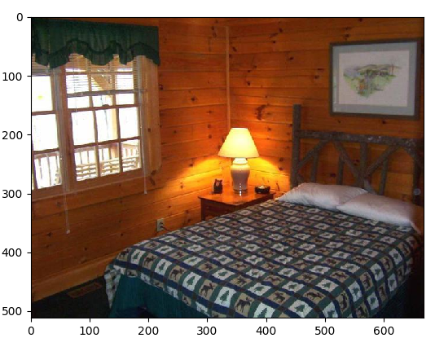
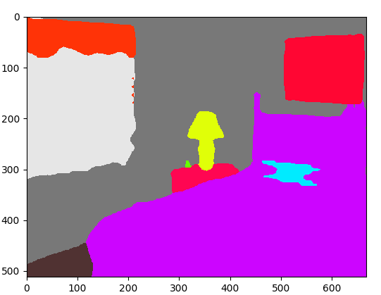

# Title:GluonCV 0.2 实现
Author ： 曹宁宁
## 一、介绍
本文会介绍GLuonCV 0.2（计算机视觉工具包第二版）中的预训练模型的简单应用。GLuonCV 0.2是mxnet框架下的工具包，这里主要使用python实现。GLuonCV 0.2主要分为以下三个方面
### 图像识别
通过ResNetV1、ResNetV2、MobileNet模型对目标图片进行种类的识别
### 物体检测
通过使用SSD及Faster-RCNN物体检测算法实现图像内的物体检测，对图像内的物体使用方框标准，并给出名称
### 图像分割
使用PSNet算法
## 二、环境配置
如之前所说，GLuonCV 0.2是mxnet框架下的工具包，首先应该将它配置到我们的计算机上。为了安装方便，我使用python中的pip来安装相应包，对于一个刚刚装好linux系统（我的是ubuntu 16.04）的“裸机”是没有pip的，使用

    sudo apt install python-pip
安装pip，这样就可以使用pip来安装mxnet框架和gluncv了。

    pip install --pre mxnet
    pip install gluoncv
安装cpu版本的mxnet直接在linux终端输入上述命令即可，如果是gpu模式的可以参看 </u>https://gluon-crash-course.mxnet.io/mxnet_packages.html </u> 中的教程。
此外，程序中有的要求安装python 的tk模块使用如下命令进行补充

    sudo apt-get install python-tk
## 三、demo
注：下述介绍只解释其中脚本的主体部分，具体要导入的包，请参看具体代码，见demo文件夹，或者本文末尾的网址中的教程。
###图像识别
在本节演示如何使用mxnet框架下的工具包gluoncv 0.2中的模型来进行简单的识别图片中的物体。
#### 1.`demo_cifar101.py`
`demo——cifar101.py`是一个很好的例子，简单的说明如何去下载使用工具包中的模型。

    url = 'https://raw.githubusercontent.com/dmlc/web-data/master/gluoncv/classification/plane-draw.jpeg'
    im_fname = utils.download(url)
    img = image.imread(im_fname)
这一段的意思是将url这个网址的图片下载下来并读取。这张图就是接下来要进行图像识别的图了。你也可以换成自己的图片，只需要将第三行的`im_fname`换成自己图片所在的路径及名称即可。
标准化图像，使得图像满足模型的要求

    transform_fn = transforms.Compose([
        transforms.Resize(32),
        transforms.CenterCrop(32),
        transforms.ToTensor(),
        transforms.Normalize([0.4914, 0.4822, 0.4465], [0.2023, 0.1994, 0.2010])
    ])
    
    img = transform_fn(img)
之后，下载名为`'cifar_resnet110_v1'`的模型

    net = get_model('cifar_resnet110_v1', classes=10, pretrained=True)
将之前下载的图形放到模型中去进行识别，并给出图像分类的域，在此取了十种。

    pred = net(img.expand_dims(axis=0))
    class_names = ['airplane', 'automobile', 'bird', 'cat', 'deer','dog', 'frog', 'horse', 'ship', 'truck']
    ind = nd.argmax(pred, axis=1).astype('int')
    print('The input picture is classified as [%s], with probability %.3f.'%(class_names[ind.asscalar()], nd.softmax(pred)[0][ind].asscalar()))
`demo——cifar101.py`中的主要部分已经介绍完毕，借来直接在脚本所在的目录下运行命令即可。

    python demo_cifar101.py
结果如下

**注意**运行脚本时会有我们要分析的图片弹出，这是因为脚本中这么要求了，必须将它关闭，脚本才能继续运行。
#### 2.`demo_imagenet.py`
但是真实的世界不可能只有十个类别，gluon cv 0.2训练的模型给出了1000个种类的分类模型，在接下来的脚本脚本中，我们使用另一个模型来进行图像的分类识别。接下来的例子我们使用`ResNet50_v2 `模型，并采取另一种方式输入目标图像。首先简单的解释下脚本内容`demo_imagenet.py`。
下面一部分主要是为了实现通过在终端的命令行输入参数，告诉脚本我们要使用的模型，图片，（或者我们提前训练好的模型也可以）。

    parser = argparse.ArgumentParser(description='Predict ImageNet classes from a given image')
    parser.add_argument('--model', type=str, required=True,
                        help='name of the model to use')
    parser.add_argument('--saved-params', type=str, default='',
                        help='path to the saved model parameters')
    parser.add_argument('--input-pic', type=str, required=True,
                        help='path to the input picture')
    opt = parser.parse_args()
如下，这里意味着我们的模型的可能的分类的名为1000个，并把名称用文件传递，而不是像第一节那样直接输入（毕竟1000个太多了）

    classes = 1000
    with open('imagenet_labels.txt', 'r') as f:
        class_names = [l.strip('\n') for l in f.readlines()]
。
然后，将相应参数传递，下载模型，读取图片。

    #load Model
    model_name = opt.model
    pretrained = True if opt.saved_params == '' else False
    kwargs = {'classes': classes, 'pretrained': pretrained}
    net = get_model(model_name, **kwargs)

    if not pretrained:
        net.load_params(opt.saved_params)

    # Load Images
    img = image.imread(opt.input_pic)
同样要标准化图形，使得其满足模型的需求

    transform_fn = transforms.Compose([
        transforms.Resize(256),
        transforms.CenterCrop(224),
        transforms.ToTensor(),
        transforms.Normalize([0.485, 0.456, 0.406], [0.229, 0.224, 0.225])
    ])

    img = transform_fn(img)
我们使用模型`ResNet50_v2`来识别图片`mt_baker.jpg`

运行下列命令即可

    python demo_imagenet.py --model ResNet50_v2 --input-pic mt_baker.jpg
结果：

还有一点与第1节不同的是，因为1000个类是一个很庞大数字，gluon cv 0.2的模型里并不能保证它把每一个图都把最好的结果分辨出来，所以在此输出最有可能的5个结果。如果我们换另一个模型`ResNet34_v2`就会得到略微不同的结果。

### 物体检测
在本节介绍如何使用mxnet框架下gluon cv 0.2工具包中的ssd模型和RCNN模型来进行图像的物体检测，使用方框将图像中的物体圈出，并给出判断。
#### 1. `demo_ssd.py`
首先，使用下述代码下载训练好的模型以及图像，至于改成自己的图片的方式请参考上节。（此外，也可以使用`[in_fname1,in_fname2,...]`来一次检测多张图片）

    net = model_zoo.get_model('ssd_512_resnet50_v1_voc', pretrained=True)
    im_fname = utils.download('https://github.com/dmlc/web-data/blob/master/' +
                              'gluoncv/detection/street_small.jpg?raw=true',
                              path='street_small.jpg')
    x, img = data.transforms.presets.ssd.load_test(im_fname, short=512)
    print('Shape of pre-processed image:', x.shape)
其中`x`是等号后边的函数`gluoncv.data.transforms.presets.ssd.load_test() `返还的图像的（batch_size, RGB_channels, height, width），`img`是矩阵形式（numpy格式）的图像。然后将图像传入模型，保存下来所见检测到的物体的类别，置信度，以及其边缘框。使用函数`gluoncv.utils.viz.plot_bbox`对结果进行显示

    class_IDs, scores, bounding_boxs = net(x)
    ax = utils.viz.plot_bbox(img, bounding_boxs[0], scores[0],
                             class_IDs[0], class_names=net.classes)
    plt.show()
运行命令

    python demo_ssd.py
得到如下图所示的结果

#### 2. `demo_faster_rcnn`
这一节和上节类次，只不过换了另一种模型，另一张图片
使用

    net = model_zoo.get_model('faster_rcnn_resnet50_v2a_voc', pretrained=True)
    im_fname = utils.download('https://github.com/dmlc/web-data/blob/master/' +
                              'gluoncv/detection/biking.jpg?raw=true',
                              path='biking.jpg')
    x, orig_img = data.transforms.presets.rcnn.load_test(im_fname)
下载模型和图片，使用下述代码对图像作处理并显示出来。

    class_IDs, scores, bounding_boxs = net(x)
    ax = utils.viz.plot_bbox(img, bounding_boxs[0], scores[0],
                             class_IDs[0], class_names=net.classes)
    plt.show()
运行

    python demo_faster_rcnn.py
得到结果

### 图像分割
在本节介绍如何使用mxnet框架下gluon cv 0.2工具包中的FCN和PSPNet模型来进行图像分割，将一个个图中的目标物体提取处理，和边缘提取的概念差不多。
#### 1. `demo_fcn.py`
首先声明使用cpu运行脚本

    ctx = mx.cpu(0)
如果想用gpu的话，先按照文章开始给出的链接安装gpu版本的mxnet框架，然后将`mx.cpu(0)`改成`mx.gpu(n)`即可。
使用下述方式，可以将制定网址的图片下载并保存为所设定的文件名`example.jpg`，然后读取图片。

    url = 'https://raw.githubusercontent.com/dmlc/web-data/master/gluoncv/segmentation/voc_examples/1.jpg'
    filename = 'example.jpg'
    gluoncv.utils.download(url, filename)
    img = image.imread(filename)
标准化图形

    transform_fn = transforms.Compose([
        transforms.ToTensor(),
        transforms.Normalize([.485, .456, .406], [.229, .224, .225])
    ])
    img = transform_fn(img)
    img = img.expand_dims(0).as_in_context(ctx)
下载训练好的模型`fcn_resnet50_voc`

    model = gluoncv.model_zoo.get_model('fcn_resnet50_voc', pretrained=True)
使用单尺度进行处理

    output = model.demo(img)
    predict = mx.nd.squeeze(mx.nd.argmax(output, 1)).asnumpy()
为了可视化，使得我们的结果更好的表现，

    mask = get_color_pallete(predict, 'pascal_voc')
    mask.save('output.png')
下述代码用于展示结果

    mmask = mpimg.imread('output.png')
    plt.imshow(mmask)
    plt.show()
终端运行

    python demo_fcn.py
得到结果

#### 2. `demo_psp.py`
这一节与上一节类似，使用新的模型新的图片。
下载图像

    url = 'https://github.com/zhanghang1989/image-data/blob/master/encoding/' + \
        'segmentation/ade20k/ADE_val_00001142.jpg?raw=true'
    filename = 'ade20k_example.jpg'
    gluoncv.utils.download(url, filename)
    img = image.imread(filename)
标准化图像

    transform_fn = transforms.Compose([
        transforms.ToTensor(),
        transforms.Normalize([.485, .456, .406], [.229, .224, .225])
    ])
    img = transform_fn(img)
    img = img.expand_dims(0).as_in_context(ctx)
下载模型`psp_resnet50_ade`

    model = gluoncv.model_zoo.get_model('psp_resnet50_ade', pretrained=True)
使用单尺度处理

    output = model.demo(img)
    predict = mx.nd.squeeze(mx.nd.argmax(output, 1)).asnumpy()
为了可视化，使得我们的结果更好的表现，并展示结果

    mask = get_color_pallete(predict, 'ade20k')
    mask.save('output.png')
    mmask = mpimg.imread('output.png')
    plt.imshow(mmask)
    plt.show()
终端运行下述命令即可：

    python demo_psp.py
得到分割前后的结果

### 结束语
至此，GluonCV 0.2工具包的三种方向的使用基本介绍完毕，每一种都demo了两种模型，GluonCV 0.2工具包自然不止这仅仅6种模型，想了解细节的可以看</u>https://gluon-cv.mxnet.io</u>，其中有模块介绍model zoo 的各个模型以及gluoncv的常用函数。