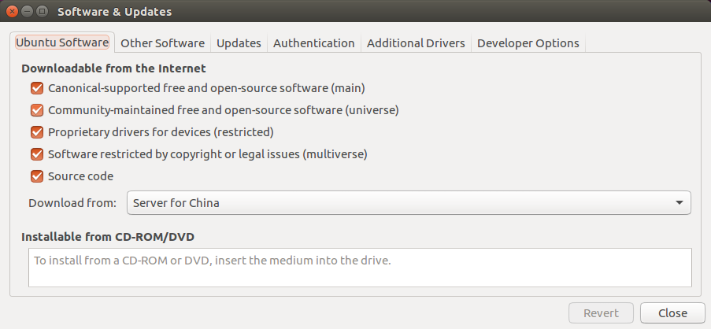
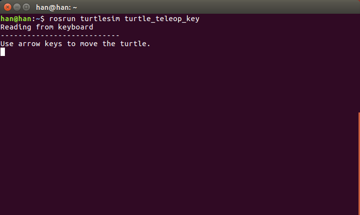
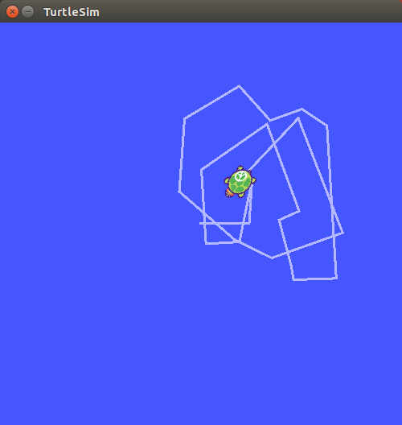

# ROS学习之路 —— 第一篇:硬件与软件配置

## ROS安装

本文档的示例均在Ubuntu 16.04 LTS环境下，此版本的Linux系统适配

ROS Kinetic, 如果你用的是Ubuntu 14，则需要适配Ros indigo，只需

将此文档中的Kinetic版本换成indigo即可

首先假定已经安装好Ubuntu系统，下面首先安装ROS:

安装教程在ROS Wiki官网上也能找到:[ROS Wiki](http://wiki.ros.org/kinetic/Installation/Ubuntu)

1. **配置Ubuntu软件更新中心**

一般来说，Ubuntu默认是配置好的，但是最好检查一下,正常配置好如下:

2. **添加source.list**

    sudo sh -c 'echo "deb http://packages.ros.org/ros/ubuntu $(lsb_release -sc) main" > /etc/apt/sources.list.d/ros-latest.list'

3. **添加keys**

    sudo apt-key adv --keyserver hkp://pool.sks-keyservers.net --recv-key 421C365BD9FF1F717815A3895523BAEEB01FA116

4. **更新环境**

这一步是为了使自己的系统环境最新，以便支持ROS的需求和功能

    sudo apt-get update

5. **安装ROS**

利用常规的apt-get方法来对ROS进行安装:

    sudo apt-get install ros-kinetic-desktop-full

注意，上面是安装kinetic版本，如果适配的是其它版本，则只需将kinetic修改

即可

6. **初始化rosdep**

    sudo rosdep init
    rosdep update

7. **环境配置**

这一步是为了使ROS在系统启动时能够自动配置好，打开终端即可用

    echo "source /opt/ros/kinetic/setup.bash" >> ~/.bashrc
    source ~/.bashrc

第一句将启动项写入.bashrc文件，也就是每次终端启动时加载的文件，第二句

刷新终端，也可以重新打开终端，也能得到一样的效果

8. **安装rosinstall**

方便以后下载相关源码

    sudo apt-get install python-rosinstall

--------------------------------------------------------------------

# ROS学习之路--第二篇: 运行小海龟

小海龟是ROS的一个示例程序，下面说明如何运行起来此程序

1. **启动ROS**

首先打开一个终端(Ctrl+Alt+t)，输入命令

    roscore

最终会提示已经启动，如果失败，则需检查ROS安装是否正确

2. **显示小海龟界面**

新打开一个终端, 输入以下命令，调出小海龟的界面:

    rosrun turtlesim turtlesim_node

3. **键盘控制小海龟运动**

这一步使用键盘上的箭头来控制小海龟的运动

    rosrun turtlesim turtle_turtleop_key

运行示例如下：

至此，我们就已经进入ROS的神奇世界，让我们继续我们的ROS之旅

----------------------------------------------------------------

# ROS学习之路--第三篇TurtleBot硬件及软件配置

我的ROS硬件设备主要有:Kobuki机器人移动底座,kinect1，rplidar激光雷达

**首先介绍Kobuki的配置方法:**

在安装好ROS之后，可以看到ROS所支持的机器人列表，搜索kobuki，如下:

    apt-cache search ros-kinetic-kobuki | less

可以看到一系列的关于Kobuki的软件包，可用apt-get方法安装

    sudo apt-get install ros-kinetic-kobuki ros-kinetic-kobuki-core

安装完成之后，即可用来驱动kobuki机器人，另外，ros可选包里也有turtlebot

的相关包，可以直接安装上，刚开始怕出错，所以顺便也将这个包安装了,安装教程

同样可以在ROS Wiki 官网找到[ROS-Wiki-Turtlebot](http://wiki.ros.org/turtlebot/Tutorials/indigo/Turtlebot%20Installation)

    sudo apt-get install ros-kinetic-turtlebot ros-kinetic-turtlebot-apps ros-kinetic-turtlebot-interactions ros-kinetic-turtlebot-simulator ros-kinetic-kobuki-ftdi ros-kinetic-rocon-remocon ros-kinetic-rocon-qt-library ros-kinetic-ar-track-alvar-msgs

现在驱动Kobuki底座的软件包已经安装好，下面就开始测试

首先用USB线将Kobuki连接到电脑,将Kobuki电源打开，灯会亮，而且会有提示声音,

然后的流程就跟小海龟的例子相似:

打开终端，首先运行ros服务:
    
    roscore

新打开一个终端，启动turtlebot:

    roslaunch trutlebot_bringup minimal.launch

再打开一个终端,启用电脑上的键盘控制

    roslaunch turtlebot_teleop keyboard_teleop.launch

根据提示，通过键盘使底座运动，i是前进

**然后介绍Kinect的配置**

Kinect分为1和2,我这里使用的是Kinect1,原理上应该是一样的，Kinect需要外接电源

供电标准为12V,1.5A,在Kobuki底座上有相应的接口,kinect的USB端口需要连接到电脑

上，以便电脑能够驱动而且能够将图像传输到电脑

首先下载openni_kinect驱动,相应的方法在ROS官网也能找到[openni_kinect](http://wiki.ros.org/openni_kinect)

    sudo apt-get install ros-kinetic-openni-camera ros-kinetic-openni-launch

上面完成之后，可以对Kinect进行测试:

RGB图像:

运行Kinect节点:

    roslaunch rbx1_vision openni_node_kinetic.launch

新打开终端

    rosrun image_view image_view image:=/camera/rgb/image_color

深度图像:

运行Kinect节点:

    roslaunch openni_launch openni.launch

新打开终端

    rosrun image_view diparity_view image:=/camera/depth/disparity

即可看到深度图像

TODO
